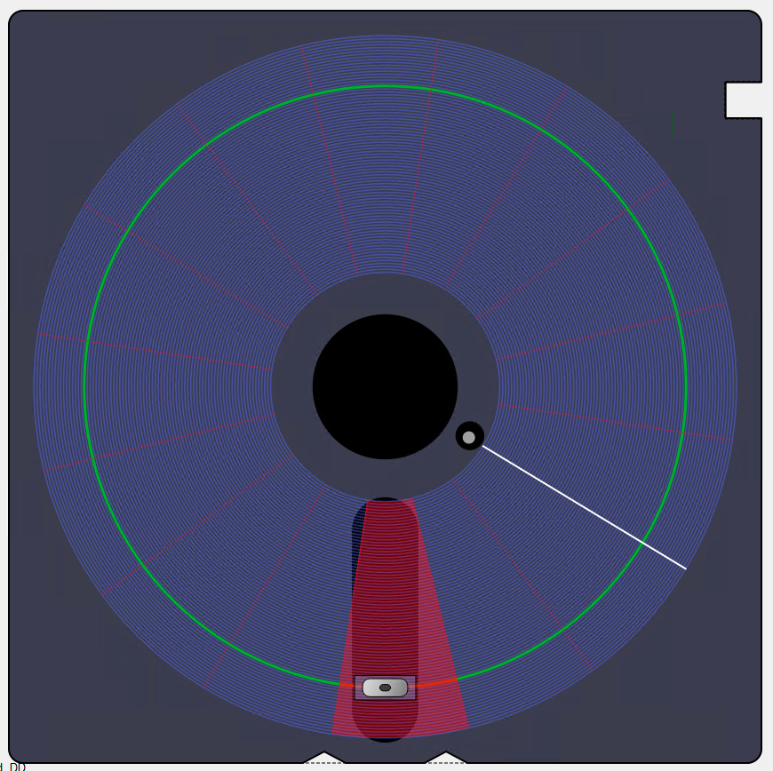

# qt-floppy

**qt-floppy** is a Qt-based graphical emulator and visualizer for 5.25" floppy disks and their controller operations. It provides an interactive, animated view of a floppy disk, including tracks, sectors, head movement, and controller status, making it ideal for educational purposes, retro computing enthusiasts, or anyone interested in the inner workings of floppy disk drives.



## Features

- **Realistic 5.25" Floppy Disk Visualization**: Shows the disk envelope, hub, index hole, write-protect notch, and read/write window.
- **Animated Tracks and Sectors**: Visualizes all tracks and sectors, with highlighting for the current track and sector.
- **Head Movement Animation**: Simulates the read/write head moving across tracks and sides, with adjustable animation speed.
- **Sector and Index Pulse Display**: Highlights the current sector under the head and simulates the index pulse.
- **Controller Status Panel**: Displays floppy disk controller (FDC) registers and status (see `FDCControllerWidget`).
- **Customizable Disk Parameters**: Supports single/double-sided and single/double-density disks, and adjustable sector count.

## Getting Started

### Prerequisites

- **Qt 6.x**: Install Qt 6 using the [official Qt website](https://www.qt.io/download-open-source).
- **CMake 3.16+
- **C++17 compatible compiler**

### Building

```sh
git clone https://github.com/yourusername/qt-floppy.git
cd qt-floppy
cmake -B build
cmake --build build
```

### Running

After building, run the executable from the `build` directory:

```sh
./build/qt-floppy
```

## Usage

- The main window displays a 5.25" floppy disk with animated tracks, sectors, and head.
- Use the controller panel to interact with the disk and observe FDC register changes.
- The status bar shows the current track, side, sector, operation (read/write), and density mode.

## License

[MIT License](LICENSE)

--- 